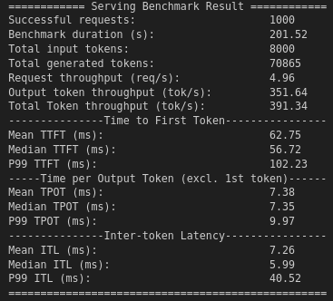
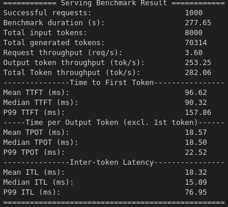

# lora-qlora-vllm-inference

This repository contains code for fine-tuning a 4-bit quantized Qwen2-VL model on the [LaTeX_OCR](https://huggingface.co/datasets/unsloth/LaTeX_OCR) dataset using the LoRA techniques and serving it efficiently with vLLM.

## Quantization:

GPTQ Quantization: We will use the [GPTQModel](https://github.com/ModelCloud/GPTQModel) for quantizing the model weights to 4-bit GPTQ format. 
NF4 Quantization: We don't need to quantize the model weights seperately using a Calibration dataset, as the model can be directly loaded in 4-bit NF4 format using the Unsloth library.

### Installation for GPTQ Quantization:
```bash
# Clone and install GPTQModel
git clone https://github.com/ModelCloud/GPTQModel.git
cd GPTQModel
pip install -v . --no-build-isolation

# Install additional dependencies
pip install optimum qwen_vl_utils
pip install -U datasets huggingface_hub fsspec

# Optional (if you're planning to use vLLM for inference)
pip install vLLM
```

## Fine-tuning Approaches:

We explore two approaches to fine-tuning:

- GPTQ-based fine-tuning: Fine-tune a 4-bit GPTQ quantized model using LoRA with the help of the Hugging Face TRL library.

- QLoRA-based fine-tuning: Fine-tune a 4-bit NF4 quantized model using QLoRA with the help of the Unsloth library.

### Installation for GPTQ-based Fine-tuning:
```bash
# Install GPTQModel from source
git clone https://github.com/ModelCloud/GPTQModel.git
cd GPTQModel
pip install -v . --no-build-isolation

# Install optimum from source
pip install git+https://github.com/huggingface/optimum.git

# Install additional dependencies
pip install qwen_vl_utils
pip install -U datasets huggingface_hub fsspec
pip install evaluate # for BLEU score
pip install python-Levenshtein # for Levenshtein distance evaluation
```

### Installation for QLoRA-based Fine-tuning:
```bash
# Install Unsloth
pip install unsloth

# Install additional dependencies
pip install qwen_vl_utils
pip install -U datasets huggingface_hub fsspec
pip install evaluate # for BLEU score
pip install python-Levenshtein # for Levenshtein distance evaluation
```

## Evaluation:

The performance of the fine-tuned models is evaluated using metrics such as:

- BLEU score

- Levenshtein edit distance

## Inference with vLLM:

We also demonstrate how to use the vLLM library for high-throughput inference using LoRA adapters on top of base models—without merging—and how to benchmark serving performance using metrics like throughput, TTFT, TPOT, and ITL.

### Installation for vLLM:
```bash
# Install vLLM from source
git clone https://github.com/vllm-project/vllm.git
cd vllm
pip install -e .
```


## Medium Articles:
The details of the implementation are explained in the following Medium articles:
- [Quantizing Qwen2-VL Models with GPTQModel and Running Efficient Inference with vLLM](https://medium.com/@arunsreekuttan1996/quantizing-qwen2-vl-models-with-gptqmodel-a-complete-guide-for-multi-modal-model-compression-and-f329ea18a17b)
- [Fine-tuning GPTQ Quantized Vision Language Models with LoRA](https://medium.com/@arunsreekuttan1996/fine-tuning-gptq-quantized-vision-language-models-with-lora-733d1e687ff5)
- [Efficiently Serve and Benchmark LoRA Fine-tuned Vision-Language Models using vLLM](https://medium.com/@arunsreekuttan1996/efficiently-serve-and-benchmark-lora-fine-tuned-vision-language-models-using-vllm-3fd8c970b809)

## Evaluation Results:

Model | BLEU Score | Levenshtein Edit Distance |
--- | --- | ---
Qwen2-VL 4-bit GPTQ (Baseline)| 0.4066 | 0.4239
Qwen2-VL 4-bit GPTQ (Finetuned) | 0.8328 | 0.0923
Qwen2-VL 4-bit QLoRA (Finetuned) | 0.8194 | 0.0997

## vLLM Serving Performance:

  
*Figure 1: Serving Performance of GPTQ Fine-tuned Model*

  
*Figure 2: Serving Performance of QLoRA Fine-tuned Model*

